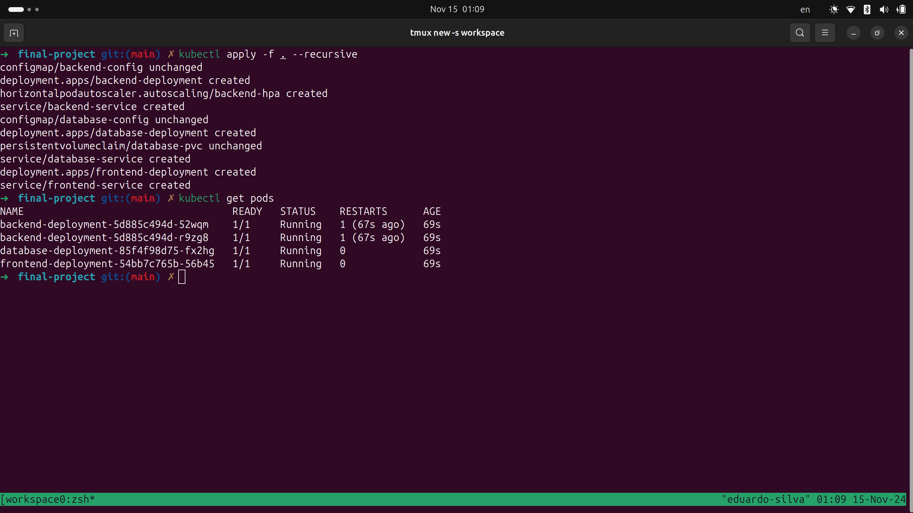
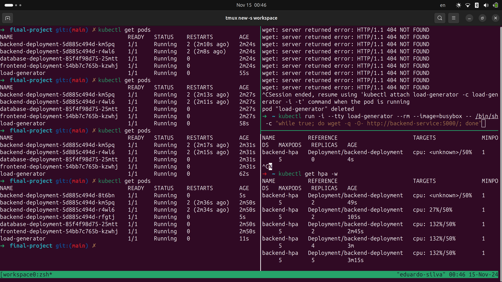

# Dependencies

- [minikube](https://minikube.sigs.k8s.io/docs/start/?arch=%2Flinux%2Fx86-64%2Fstable%2Fbinary+download#Ingress)
- [docker](https://docs.docker.com/engine/install/ubuntu/)
- [kubectl](https://kubernetes.io/docs/tasks/tools/install-kubectl-linux/)

# Setup

```sh
# You cannot set a static IP for an existent cluster. Delete that.
# https://minikube.sigs.k8s.io/docs/tutorials/static_ip/
$ minikube delete
$ minikube start --static-ip 192.168.49.3
$ minikube addons enable metrics-server # <- Allow you test HPA

# wait for at least 40s~60s until all backends are healthy.
$ kubectl apply -f . --recursive
```

# Clean up
```sh
$ kubectl delete all --all
$ minikube delete
```

# Show case

#### Access http://192.168.49.3:30300/index.html and play the game


#### Manifest applied & Pods


#### Testing HPA


